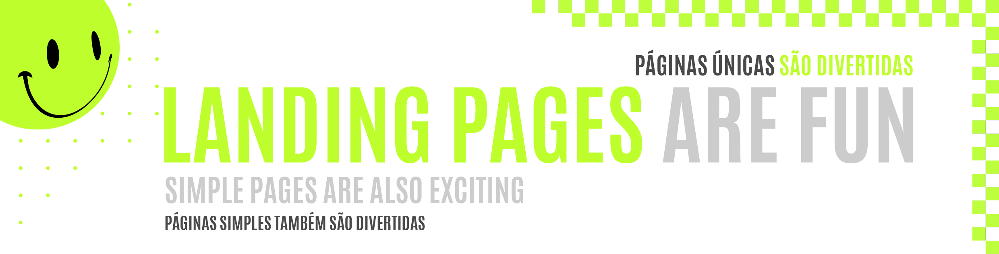

 
 

|                                                          |
| :------------------------------------------------------: |
|  |
|             **Landing Page #01:** Business Agency Concept              |
| **Original Project:** [🌐](https://img.freepik.com/free-psd/business-concept-landing-page-template_23-2148712809.jpg?w=1380&t=st=1688399422~exp=1688400022~hmac=7538f9240772671e6a6a4a74a6a53df9235200770ef9ce74611dabe36796b6ef) / **My Code:** [📄](https://github.com/malunaridev/Landing-Pages-Are-Fun-01-to-10/tree/master/1-business-agency-concept) / **Live Preview:** [🌐](https://lpaf-business-agency-concept.vercel.app/)

 
 

 

The first landing page I have build with pure HTML and CSS was a business concept. I choose this one because I liked the colors and the whole idea of building something that could fit a professional need. 

##### A primeira landing page que construí com puro HTML e CSS tem um conceito profissional. Eu escolhi essa temática porque gostei das cores e de toda a ideia de ser algo a ser construído para fins profissionais.

 
 
 

 

- HTML
- CSS

 
 
 

 

| Validator                                                                        |                     Passed                     |
| -------------------------------------------------------------------------------- | :--------------------------------------------: |
| [Markup Validation Service](https://validator.w3.org/) - <em>w3.org</em>         |  |
| [CSS Validation Service](https://jigsaw.w3.org/css-validator/) - <em>w3.org</em> |  |

 
 
 

 

As a begginner in building landing pages, I have a little bit of trouble learning how I could fit a whole page into just one section. I needed to study viewports, so I did my best to use some breakpoints that was mostly useful. Also, i did the mobile concept by myself, because I hav no mobile themed image to base my code on.

##### Como uma pessoa iniciante na construção de landing pages, eu tive um pouco de trabalho em aprender como eu poderia fazer caber uma página inteira em uma única seção. Eu precisei estudar viewports, então eu dei o meu melhor em estudar e construir aquelas que fossem mais úteis. Também fiz o design da versão mobile, mesmo sem ter nenhuma imagem de referência.

 
 
 

