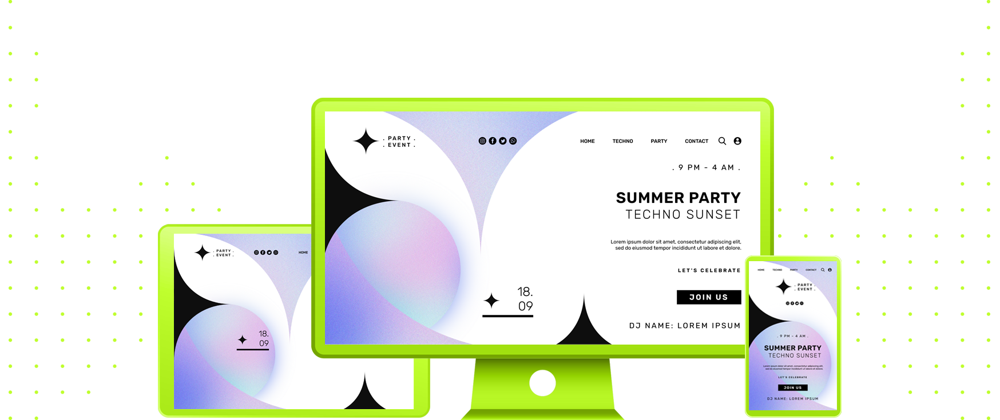

 
 

|                                                          |
| :------------------------------------------------------: |
|  |
|             **Landing Page #03:** Summer Party Landing Page              |
| **Original Project:** [🌐](https://img.freepik.com/free-psd/flat-design-wellness-template_23-2150059738.jpg?w=1380&t=st=1688399894~exp=1688400494~hmac=eddbad0a8132cc3f67aaae7239d597f1c8d9545ab99f764ac194a2671dbf2f16) / **My Code:** [📄](https://github.com/malunaridev/Landing-Pages-Are-Fun/tree/master/2-flat-design-%20wellness-template) / **Live Preview:** [🌐](https://lpaf-2-wellness-template.vercel.app/)

 
 

 

The third landing page was a special concept designed for an event! I had a lot of fun trying to figure out which divs I should use, and the position was a little bit challenging too.

##### Minha segunda landing page foi também uma simples, e a construí também com pouco código. Ela não tem um design muito grande e especial, nem um conceito muito profissional nos dias de hoje, mas eu me diverti bastante com essa nova ideia de design.

 
 
 

 

- HTML
- CSS

 
 
 

 

| Validator                                                                        |                     Passed                     |
| -------------------------------------------------------------------------------- | :--------------------------------------------: |
| [Markup Validation Service](https://validator.w3.org/) - <em>w3.org</em>         |  |
| [CSS Validation Service](https://jigsaw.w3.org/css-validator/) - <em>w3.org</em> |  |

 
 
 

 

The third landing page was a bit challenging because of the background, I had to configure the height in a way that could fit both desktop and mobile version. This took me some time, but I could finally figure out!

##### Eu usei as propriedades de <code>background-position</code> quando estava construindo a versão para celular, e foi muito divertido ver como eu poderia mover o fundo um pouco para que os círculos fossem vistos, mesmo na versão mobile, na qual eu achava queeprderia algumas partes do fundo da landing page.

 
 
 

