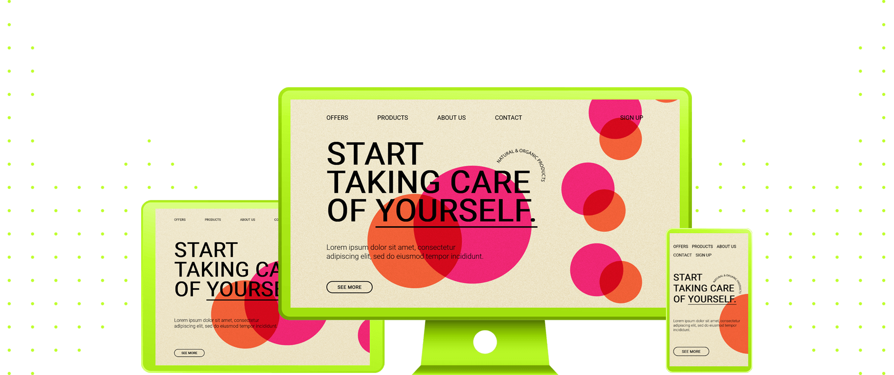

 
 

 

This is a personal project where I build some landing pages for fun. It helps me to learn new things, test new technologies and keep my portfolio growing everyday. All the landing pages examples were found on internet: none of them were designed by me. As my knowledge grow, I will keep coming back to old projects to apply new features and keep improving my skills.

##### Este repositório faz parte de um projeto pessoal onde eu construo landing pages por diversão. Isso me ajuda a aprender coisas novas, testar novas tecnologias e manter o meu portfólio pessoal crescendo a cada dia. Todos os templates das landing pages foram encontrados pela internet: nenhum deles foi desenhado por mim. À medida que meu conhecimento cresce, eu retornarei a este repositório para aplicar novas funcionalidades e, aos poucos, ir melhorando as minhas habilidades.

 
 
 

 

  
  
   

- [Animate.css](https://animate.style/)
- [Font Awesome](https://fontawesome.com/)

 
 
 

 

|         |             |    
| :-------------:|:-------------:|
|  |   |
| **Landing Page #1:** Business Agency Concept   | **Landing Page #2:** Flat Design Wellness Template  
| **Code:** [📄](https://github.com/malunaridev/Landing-Pages-Are-Fun-01-to-20/tree/master/1-business-agency-concept) \| **Live Preview:** [🌐](https://lpaf-business-agency-concept.vercel.app/) | **Code:** [📄](https://github.com/malunaridev/Landing-Pages-Are-Fun-01-to-20/tree/master/2-flat-design-wellness-template) \| **Live Preview:** [🌐](https://lpaf-2-wellness-template.vercel.app/) 

 
 
 

